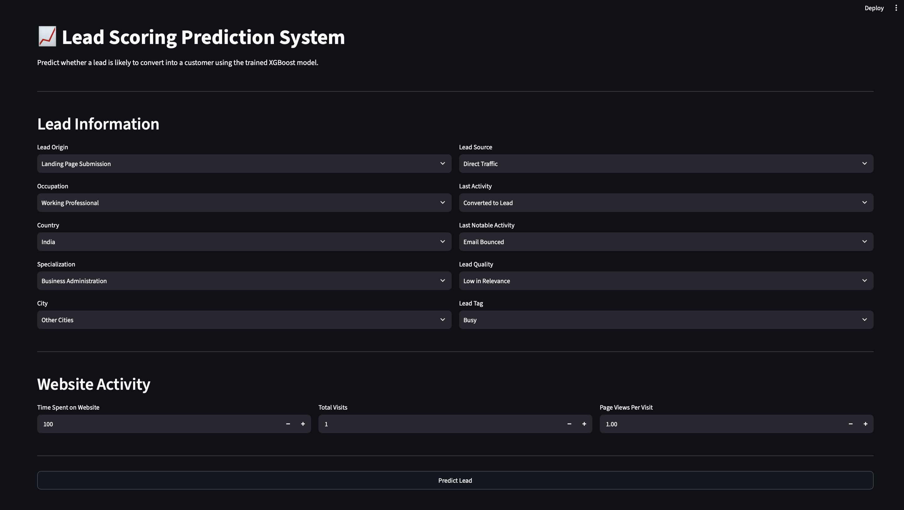
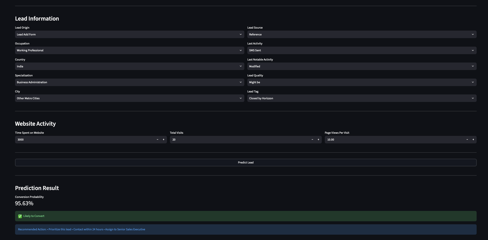
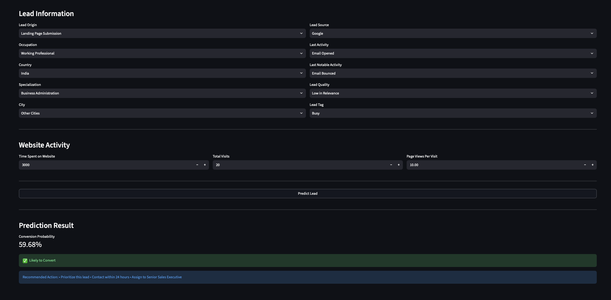
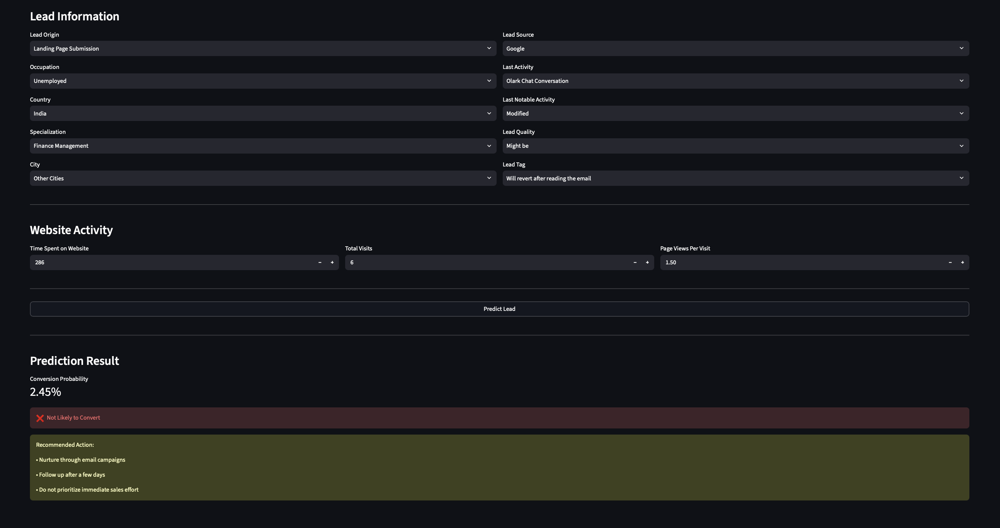

# 📈 Lead Scoring Prediction System

An end-to-end Machine Learning project that predicts whether a potential customer (lead) is likely to convert into a paying customer.

The project includes complete data preprocessing, feature engineering, model training using XGBoost, model evaluation, and deployment through an interactive Streamlit web application.

---

## 🚀 Project Overview

Businesses receive thousands of leads through different marketing channels. Prioritizing high-quality leads helps improve conversion rates and optimize sales efforts.

This project builds a Lead Scoring Prediction System that classifies leads as likely or unlikely to convert using historical customer data.

---

## 🎯 Objectives

- Analyze customer lead data
- Perform data preprocessing and feature engineering
- Train and evaluate multiple Machine Learning models
- Select the best-performing model
- Deploy the model using Streamlit
- Provide real-time lead conversion predictions

---

## 🛠️ Technologies Used

- Python
- Pandas
- NumPy
- Scikit-learn
- XGBoost
- Joblib
- Streamlit

---

## 📂 Project Structure

```
LeadScoringApp/
│
├── notebook/
│   └── major_project_lead_Score.ipynb
│
├── artifacts/
│   ├── model.pkl
│   └── feature_columns.pkl
│
├── app.py
├── requirements.txt
├── README.md
└── .gitignore
```

---

## ⚙️ Machine Learning Workflow

1. Data Collection
2. Data Cleaning
3. Missing Value Handling
4. Feature Engineering
5. One-Hot Encoding
6. Train-Test Split
7. Model Training
8. Model Evaluation
9. Model Selection
10. Model Serialization
11. Streamlit Deployment

---

## 📊 Model

The final deployed model is:

**XGBoost Classifier**

The trained model is saved as:

```
artifacts/model.pkl
```

The feature order used during deployment is stored in:

```
artifacts/feature_columns.pkl
```

---

## 🖥️ Streamlit Application

The application allows users to:

- Enter lead details
- Predict lead conversion probability
- Classify leads as:
  - Likely to Convert
  - Not Likely to Convert
- Receive basic business recommendations based on prediction results

---
## 📸 Application Screenshots

### 🏠 Home Page



---

### 📊 Prediction Result

### 🎯 High Probability Prediction



### 🎯 Medium Probability Prediction



### 🎯 Low Probability Prediction



---

## ▶️ Installation

Clone the repository:

```bash
git clone <repository-url>
```

Navigate to the project folder:

```bash
cd LeadScoringApp
```

Install dependencies:

```bash
pip install -r requirements.txt
```

---

## ▶️ Run the Application

```bash
streamlit run app.py
```

---

## 📷 Application Preview

The Streamlit application includes:

- Lead Information Form
- Website Activity Inputs
- Prediction Probability
- Lead Classification
- Recommended Business Actions

---

## 📌 Future Improvements

- Feature importance visualization in the app
- SHAP-based prediction explanations
- Batch prediction using CSV upload
- Model retraining pipeline
- Cloud deployment

---

## 👨‍💻 Author

**Aditya Singh**

B.Tech Computer Science (Artificial Intelligence)

Swami Keshwanand Institute of Technology, Jaipur

---

## 📄 License

This project is developed for educational and internship purposes.
